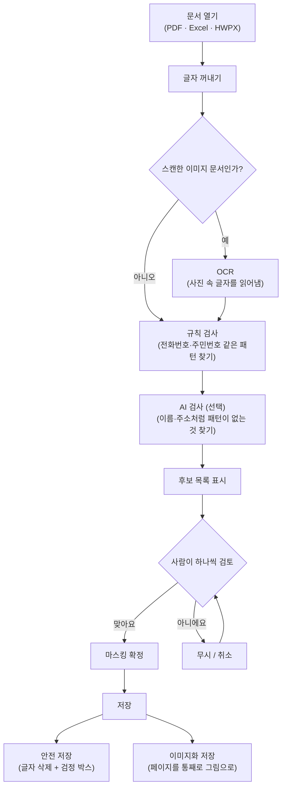
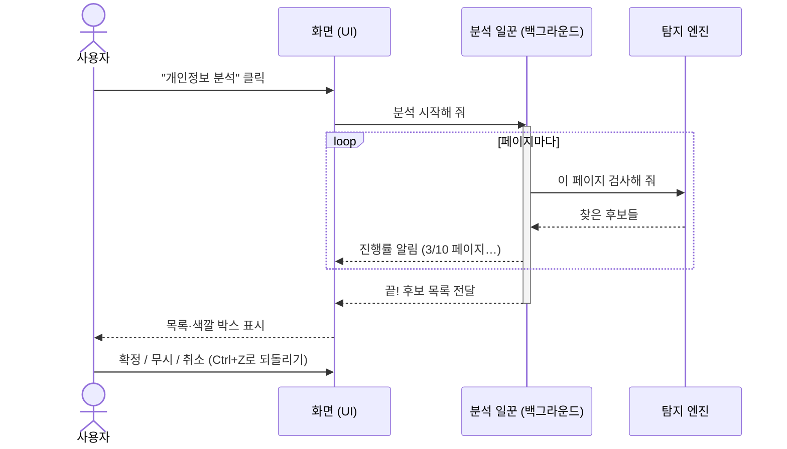
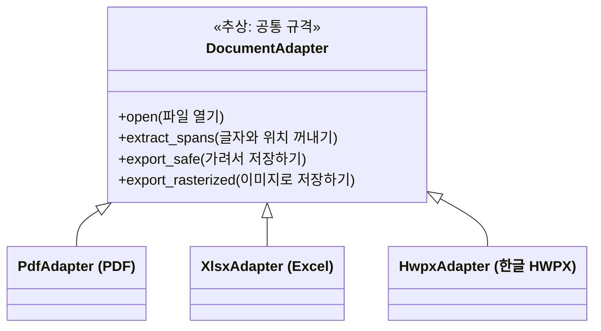

# Private Data Remover

PDF(및 향후 Office 문서)에서 개인정보를 탐지·검토·마스킹하고,  
텍스트까지 제거된 안전한 파일로 저장하는 **크로스플랫폼 데스크탑 앱**입니다.

| 항목 | 내용 |
|------|------|
| 버전 | **0.2.1** |
| OS | Windows / macOS / Linux |
| UI | PySide6 |
| AI | Ollama(로컬) 또는 OpenAI / Anthropic(Claude) API |
| 라이선스 | Apache-2.0 (앱) + [의존성/AGPL 고지](docs/LICENSING.md) |

- 상세 요구사항: [`docs/PRD.md`](docs/PRD.md)
- Adapter 계약: [`docs/adapters.md`](docs/adapters.md)
- 사용 가이드: [`docs/USER_GUIDE.md`](docs/USER_GUIDE.md)
- 빌드: [`docs/BUILD.md`](docs/BUILD.md)
- 변경 이력: [`CHANGELOG.md`](CHANGELOG.md)

> README는 PRD·기능·설치 방법이 바뀔 때마다 함께 갱신합니다.

---

## 주요 기능

### PDF / Excel / HWPX

- PDF 열기, 페이지 미리보기, 탐지 영역 오버레이
- **Excel (.xlsx)**: 셀 PII, **숨긴 시트/행/열** 탐지·미리보기, 셀 치환/검정 채우기 export
- **HWPX**: 섹션 텍스트 추출·문자열 치환 export (spike 기반 MVP)
- **OCR** (Tesseract) — 스캔 PDF 지원
- 규칙 + LLM 기반 개인정보 탐지
- 검출 항목마다 **개인정보 유형** 표시
- **수동 마스킹**, 패턴 일괄 적용, Undo/Redo, 무시 영역

### 저장

| 모드 | 설명 |
|------|------|
| **안전 저장** | 선택 구간 **텍스트 삭제** + 해당 위치에 **검정 마스킹 박스** |
| **페이지 이미지화 후 PDF 저장** | 페이지 전체를 래스터라이즈한 뒤 PDF로 저장 |

원본 파일은 수정하지 않습니다.

### 로드맵 (확장)

- **Excel** (`.xlsx` 등): 셀 개인정보, 숨겨진 시트, 숨김 행·열, 정의된 이름, 메타데이터
- **HWPX**: 본문·머리글·숨김 영역·문서 속성 등

공통 `DocumentAdapter` 인터페이스로 PDF와 분리해 추가합니다. 자세한 내용은 [PRD §포맷 확장](docs/PRD.md#12-포맷-확장-excel--hwpx)을 참고하세요.

---

## 아키텍처 (요약)

```text
GUI (PySide6)
  └── Core (포맷 비의존 도메인)
        ├── adapters/pdf      (PDF)
        ├── adapters/xlsx     (Excel)
        ├── adapters/hwpx     (HWPX)
        ├── pii/              (rules + LLM)
        ├── pattern/
        ├── mask/ + undo
        └── export/
```

---

## 동작 원리 (쉽게 이해하기)

이 프로그램이 하는 일을 한 문장으로 줄이면 이렇습니다.

> **문서에서 글자를 꺼내서 → 개인정보로 보이는 부분을 찾고 → 사람이 확인한 뒤 → 검게 가린 새 파일을 만든다.**

### 1) 전체 흐름

문서를 열고 저장하기까지의 과정입니다. 원본 파일은 절대 고치지 않고, 항상 **새 파일**을 만듭니다.



- **규칙 검사**: 전화번호(`010-1234-5678`)처럼 **모양이 정해진** 개인정보는 정규식 규칙으로 찾습니다.
- **AI 검사**: 이름·주소처럼 모양이 제각각인 것은 AI(LLM)에게 "이 글에서 개인정보를 찾아줘"라고 물어봅니다.
  로컬 Ollama를 쓰면 문서가 컴퓨터 밖으로 나가지 않습니다.

### 2) 분석 버튼을 누르면 생기는 일

분석은 시간이 걸릴 수 있어서 **뒤에서 일하는 일꾼(백그라운드 스레드)** 에게 맡깁니다.
그래서 분석 중에도 화면이 멈추지 않고, 진행률과 취소 버튼이 동작합니다.



### 3) 여러 문서 형식을 다루는 방법

문서 형식마다 "여는 법·글자 꺼내는 법·저장하는 법"이 다릅니다.
그래서 형식마다 **어댑터**(변환 플러그)를 하나씩 두고, 나머지 프로그램은 어떤 형식인지 몰라도 되게 만들었습니다.
새 형식을 지원하려면 어댑터만 하나 더 만들면 됩니다.



---

## 요구 사항

| 구성 | 내용 |
|------|------|
| Python | 3.11+ 권장 |
| Qt | PySide6 |
| PDF | PyMuPDF (`pymupdf`) — AGPL 고지 참고 |
| OCR | [Tesseract](https://github.com/tesseract-ocr/tesseract) + `kor`, `eng` |
| LLM (선택) | [Ollama](https://ollama.com/) 또는 OpenAI / Anthropic API 키 |

---

## 설치

### 1) 저장소 클론

```bash
git clone https://github.com/progh2/privatedataremover.git
cd privatedataremover
python -m venv .venv
```

Windows:

```powershell
.venv\Scripts\activate
pip install -e ".[dev]"
```

macOS / Linux:

```bash
source .venv/bin/activate
pip install -e ".[dev]"
```

### 2) Tesseract (OCR)

- **Windows:** [공식 설치 패키지](https://github.com/UB-Mannheim/tesseract/wiki) 설치 후 PATH에 추가. 앱 설정에서 `tesseract` 경로를 지정할 수 있습니다.
- **macOS:** `brew install tesseract tesseract-lang`
- **Linux:** `sudo apt install tesseract-ocr tesseract-ocr-kor` (배포판에 맞게)

### 3) Ollama (로컬 LLM, 선택)

```bash
# Ollama 설치 후 예:
ollama pull llama3.2
```

앱 설정에서 Base URL(기본 `http://localhost:11434`)과 모델명을 지정합니다.

### 4) 실행

프로젝트 루트의 실행 스크립트를 쓰거나, 직접 모듈할 수 있습니다.

| OS | 명령 |
|----|------|
| Windows (CMD) | `run.cmd` |
| Windows (PowerShell) | `.\run.ps1` |
| Linux / macOS | `./run.sh` |

```bash
# 또는
python -m privatedataremover
```

스크립트는 `.venv`/`venv`가 있으면 자동 활성화하고, 패키지가 없으면 `pip install -e ".[dev]"`를 시도합니다.

앱이 실행되면 **파일 → 열기** 또는 PDF 드래그앤드롭으로 문서를 열고, **도구 → 설정**에서 LLM(Ollama/OpenAI/Claude)·로컬 전용 모드·Tesseract 경로를 구성할 수 있습니다.

패키징(설치형 바이너리)은 릴리스 마일스톤에서 제공합니다.

---

## 사용 방법

1. **설정**에서 LLM 프로바이더를 고릅니다 (Ollama / OpenAI / Claude).  
   API 키는 로컬에만 저장됩니다. **로컬 전용 모드**에서는 외부 API를 호출하지 않습니다.
2. **파일 → 열기**로 PDF를 엽니다.
3. **분석 실행** — 툴바 **개인정보 분석**(Ctrl+R). OCR·LLM 옵션 체크 가능.  
   규칙(+선택 LLM)으로 후보를 찾고 목록·오버레이에 **유형**이 표시됩니다.
4. **검토** — 확정 / 무시 / 마스킹 취소, 유형 필터, **마스킹 그리기(M)** 로 수동 박스.
5. **패턴 적용** — 현재 페이지 확정 마스크를 시드로 **비슷한 페이지에 적용…**(Ctrl+Shift+A)  
   → 미리보기·페이지 선택 → 일괄 반영. **마지막 패턴 적용 취소** / **실행 취소**로 롤백.
6. **무시 영역** — 툴바에서 무시 영역 그리기로 지정한 구간은 이후 분석에서 제외됩니다.
7. **저장**
   - `안전 저장…` — 확정 영역 **텍스트 삭제 + 검정 박스** (원본 비수정 사본)
   - `페이지 이미지화 후 PDF로 저장…` — DPI 선택 후 전체 래스터 PDF
   - 저장 후 잔존 텍스트 검사, 미확정 항목 경고


### 팁

- 스캔본은 OCR 품질에 따라 누락될 수 있습니다. 중요 문서는 수동 확인 + 이미지화 저장을 권장합니다.
- API 사용 시 텍스트 청크가 외부로 전송될 수 있습니다. 민감 자료는 Ollama(로컬)를 권장합니다.

---

## 개발·기여

이슈 / 마일스톤 / GitHub Projects로 작업을 관리합니다.  
보드·마일스톤 링크: [`docs/GITHUB.md`](docs/GITHUB.md)  
기여 방법: [`CONTRIBUTING.md`](CONTRIBUTING.md)

```bash
pytest
```

---

## 로드맵

| 마일스톤 | 내용 |
|----------|------|
| M0 | Repo & Docs ✅ |
| M1 | Shell UI & PDF View ✅ |
| M2 | Detect & Manual Mask ✅ (OCR·규칙/LLM 탐지·유형·수동 마스킹·취소) |
| M3 | Pattern & Undo ✅ (유사 페이지·일괄 적용·Undo/Redo·무시 영역) |
| M4 | Export ✅ (안전 저장 / 이미지화 PDF / 잔존 검사) |
| M5 | Release v0.1.0 ✅ |
| M6 | Excel / HWPX ✅ (adapter·숨김 시트·spike MVP) |
| M7 | Hardening & Polish ✅ (크래시 수정·이름/주소 탐지·백그라운드 분석·검토 UX) |

---

## 보안·면책

본 도구는 비식별 **보조** 도구이며, 법적 “완전 비식별”을 보장하지 않습니다.  
내보내기 전 반드시 사람이 검토하세요.

---

## 라이선스

Apache License 2.0 — [`LICENSE`](LICENSE)  
서드파티·PyMuPDF AGPL 정책: [`THIRD_PARTY_NOTICES.md`](THIRD_PARTY_NOTICES.md), [`docs/LICENSING.md`](docs/LICENSING.md)
