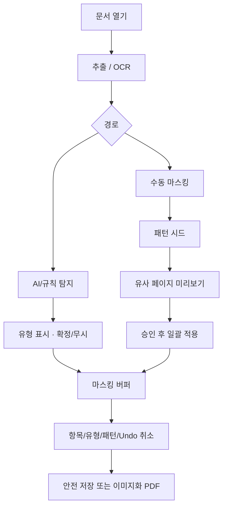

# PRD: Private Data Remover

| 항목 | 내용 |
|------|------|
| 문서 버전 | 1.4 |
| 상태 | Active |
| 플랫폼 | Windows / macOS / Linux |
| UI | PySide6 |
| 라이선스 | Apache-2.0 (앱). 의존성 별도 고지 |
| 관련 문서 | [README](../README.md) |

기능·설치·사용법이 바뀌면 **README와 본 PRD를 같은 PR에서 함께 갱신**합니다.

---

## 1. 제품 개요

### 1.1 한 줄 정의

PDF 문서를 AI·규칙·OCR로 분석해 개인정보를 탐지·표시하고, 사용자 확인 후 마스킹(검정 박스 / 내용 삭제)하여 **텍스트까지 제거된 안전한 PDF**로 저장하는 크로스플랫폼 데스크탑 GUI 앱.

### 1.2 문제

- 반복 양식 PDF에서 개인정보를 수작업으로 가리기 비효율적
- 시각적 덮개만 하면 원문 텍스트가 남아 유출 위험
- 기관·개인마다 LLM 환경이 다름(로컬 의무 vs 클라우드 API)
- 향후 Excel·HWPX 등 다른 포맷에서도 숨김 데이터 점검 수요

### 1.3 목표

1. OS에 무관하게 동일 UX로 PDF 비식별 처리
2. 로컬 LLM(Ollama) 또는 외부 API(Claude, ChatGPT)로 PII 탐지
3. 페이지 반복 패턴 분석 및 **수동 마스킹 기반 패턴 학습** → 확인 후 일괄 반영
4. 오탐/예외 무시, 유형·항목 단위 마스킹 취소
5. 내보내기 시 렌더·텍스트 레이어에서 개인정보 잔존 최소화
6. `DocumentAdapter`로 Excel·HWPX 확장을 가능하게 설계

### 1.4 Non-Goals (초기)

- 서버 SaaS / 다중 사용자 협업
- 법적 “완전 비식별” 인증·감사 대행
- Excel / HWPX 완전 구현 (M6+ 로드맵)

---

## 2. 확정된 제품 결정

| 결정 | 내용 |
|------|------|
| GUI | PySide6 |
| OCR | MVP 포함 (Tesseract) |
| 기본 저장 | 선택적 텍스트 삭제 + 검정 마스킹 박스 |
| 추가 저장 | 페이지 전체 이미지화 후 PDF |
| 공개 | 오픈소스 (Apache-2.0) |
| 확장 | DocumentAdapter로 xlsx / hwpx 추가 가능 |

---

## 3. 사용자·시나리오

| 페르소나 | 니즈 |
|----------|------|
| 공공·교육 담당자 | 제출용 PDF 비식별, 가능하면 로컬 LLM |
| 법무·컴플라이언스 | 유형별 검토·취소, 오탐 보정 |
| 개인/프리랜서 | API 키로 빠른 처리 |

### 핵심 시나리오

1. **반복 양식 일괄 마스킹** — AI 또는 수동 시드 → 미리보기 → 전체 적용
2. **전수 AI 스캔** — 탐지 목록·유형 표시 → 무시/확정/취소 → 저장
3. **수동 우선** — 직접 박스 → 패턴 전파 → 예외 페이지만 수정
4. **로컬 전용** — Ollama만 사용, 외부 네트워크 차단 옵션

---

## 4. 기능 요구사항

### 4.1 PDF 입·출력

| ID | 요구사항 | 우선순위 |
|----|----------|----------|
| F-IO-01 | PDF 열기(드래그앤드롭, 파일 대화상자) | P0 |
| F-IO-02 | 페이지 썸네일·확대·이동·페이지 점프 | P0 |
| F-IO-03 | 원본 비수정, 사본으로만 저장 | P0 |
| F-IO-04 | 암호·손상 PDF 명확한 오류 | P1 |
| F-IO-05 | 대용량 진행률·취소 | P1 |

### 4.2 저장·내보내기

| ID | 요구사항 | 우선순위 |
|----|----------|----------|
| F-EX-01 | **안전 저장**: 확정 영역 텍스트 삭제 + 동일 좌표 검정 박스 | P0 |
| F-EX-02 | **페이지 이미지화 후 PDF 저장** (별도 메뉴/버튼) | P0 |
| F-EX-03 | 이미지화 옵션: DPI, 품질 (P1) | P1 |
| F-EX-04 | 저장 전 잔존 텍스트 검증·경고 | P1 |
| F-EX-05 | 미확정 항목 있으면 저장 경고 | P1 |
| F-EX-06 | 임시 파일 정리 | P0 |

### 4.3 OCR

| ID | 요구사항 | 우선순위 |
|----|----------|----------|
| F-OCR-01 | 텍스트 레이어 부재/빈약 시 OCR | P0 |
| F-OCR-02 | Tesseract (kor+eng), 경로·언어 설정 | P0 |
| F-OCR-03 | OCR bbox ↔ 뷰어 좌표 정렬 | P0 |
| F-OCR-04 | 미설치 시 안내 | P0 |
| F-OCR-05 | OCR 결과를 규칙/LLM 파이프라인에 투입 | P0 |

### 4.4 AI·규칙 기반 개인정보 탐지

| ID | 요구사항 | 우선순위 |
|----|----------|----------|
| F-AI-01 | 텍스트(+OCR) 후 LLM 구조화 PII 후보 | P0 |
| F-AI-02 | 유형: 이름, 주민등록번호, 여권, 운전면허, 전화, 이메일, 주소, 계좌, 카드, 생년월일, 사번/학번 등 (설정 on/off) | P0 |
| F-AI-03 | 후보별 페이지, bbox, 유형, 신뢰도, 스니펫 | P0 |
| F-AI-04 | PDF 오버레이 하이라이트 | P0 |
| F-AI-05 | 규칙(정규식) + LLM 하이브리드 | P1 |
| F-AI-06 | 페이지/영역 재분석 | P1 |

### 4.5 개인정보 유형 표시

| ID | 요구사항 | 우선순위 |
|----|----------|----------|
| F-TYP-01 | 탐지·오버레이·목록에 유형 라벨 | P0 |
| F-TYP-02 | 호버/선택 시 유형 배지·툴팁 | P0 |
| F-TYP-03 | 목록: 페이지·유형·스니펫·신뢰도·출처·상태 | P0 |
| F-TYP-04 | 색+텍스트 라벨 (색만 구분 금지) | P0 |
| F-TYP-05 | 유형별 필터 | P0 |
| F-TYP-06 | 수동 마스킹에도 유형 지정 (`사용자 지정` 허용) | P0 |

### 4.6 수동 마스킹

| ID | 요구사항 | 우선순위 |
|----|----------|----------|
| F-MAN-01 | 드래그로 사각형 생성 | P0 |
| F-MAN-02 | 이동·리사이즈·삭제 | P0 |
| F-MAN-03 | 영역별 처리: 검정 박스 / 내용 삭제(+박스) | P0 |
| F-MAN-04 | Delete / Esc 단축키 | P0 |
| F-MAN-05 | 확대·축소 시 좌표 정확 매핑 | P0 |

### 4.7 수동 마스킹 기반 패턴 학습

| ID | 요구사항 | 우선순위 |
|----|----------|----------|
| F-LRN-01 | 사용자 확정/수동 마스킹을 패턴 시드로 지정 | P0 |
| F-LRN-02 | 유사 레이아웃 페이지에 동일 상대/절대 위치 제안 | P0 |
| F-LRN-03 | 미리보기 후 승인 시에만 전체 적용 | P0 |
| F-LRN-04 | 절대 좌표 / 페이지 비율 옵션 (앵커는 P1) | P0 |
| F-LRN-05 | 예외 페이지 제외·표시 | P0 |
| F-LRN-06 | AI 결과와 병합 (기본 합집합, 수동 우선 옵션) | P1 |
| F-LRN-07 | 패턴 프리셋 저장 (P2) | P2 |

### 4.8 마스킹 취소·Undo

| ID | 요구사항 | 우선순위 |
|----|----------|----------|
| F-UN-01 | 선택 영역 즉시 제거 | P0 |
| F-UN-02 | 다중 선택 일괄 취소 | P0 |
| F-UN-03 | 현재 페이지 마스킹 모두 지우기 | P0 |
| F-UN-04 | 패턴 일괄 적용분 롤백 | P0 |
| F-UN-05 | 전역 Undo/Redo | P0 |
| F-CX-01 | 항목 단위 마스킹 취소 | P0 |
| F-CX-02 | 같은 유형 전부 취소 | P0 |
| F-CX-03 | 현재 페이지에서 해당 유형만 취소 | P0 |
| F-CX-04 | 취소 후 재자동적용 방지(무시/해제 상태) | P0 |
| F-CX-05 | 유형 세션 무시 규칙 (P1) | P1 |

### 4.9 LLM·설정

| ID | 요구사항 | 우선순위 |
|----|----------|----------|
| F-CF-01 | Ollama, OpenAI, Anthropic 최소 지원 | P0 |
| F-CF-02 | API 키·엔드포인트·모델 로컬 저장(마스킹 표시) | P0 |
| F-CF-03 | 연결 테스트 | P0 |
| F-CF-04 | 로컬 전용 모드 | P1 |
| F-CF-05 | 한국어 UI 기본 | P1 |

### 4.10 보안

| ID | 요구사항 | 우선순위 |
|----|----------|----------|
| F-SEC-01 | API 키 안전 저장 | P0 |
| F-SEC-02 | 외부 API 전송 범위 안내 | P0 |
| F-SEC-03 | 기본: 텍스트 청크만 전송 (PDF 바이너리 미전송) | P0 |
| F-SEC-04 | 로그에 원문 PII 최소화 | P1 |

---

## 5. UX

### 화면

1. 홈/열기
2. 작업 공간 — 좌: 페이지, 중: 뷰어+오버레이, 우: 탐지 목록(유형·필터)
3. 패턴 마법사 — 시드 → 미리보기 → 일괄 적용
4. 설정 — LLM, OCR, 탐지 유형, 내보내기

### 저장 메뉴

```text
파일
 ├─ 열기…
 ├─ 안전 저장…                    ← 텍스트 삭제 + 검정 박스
 ├─ 페이지 이미지화 후 PDF로 저장… ← 전체 래스터
 └─ 종료
```

### 툴바 (마스킹)

```text
[선택] [마스킹 그리기] [삭제]
[이 마스킹을 비슷한 페이지에 적용…]
[실행 취소] [다시 실행]
[페이지 마스킹 모두 지우기]
```

목록 출처: `수동` / `AI` / `규칙` / `패턴#N`

### 원칙

- AI·패턴은 **제안**; 최종 책임은 사용자 확인
- 일괄 적용 전 Undo 가능
- 색맹 고려: 색+라벨

---

## 6. 비기능 요구사항

| ID | 항목 | 기준 |
|----|------|------|
| NF-01 | 크로스플랫폼 | Win 10+, macOS 12+, 주요 Linux |
| NF-02 | 오프라인 | Ollama 시 핵심 탐지·마스킹·저장 가능 |
| NF-03 | 성능 | 텍스트 PDF 50p 규칙 스캔은 비동기·진행률 |
| NF-04 | 메모리 | 페이지 단위 로드 |
| NF-05 | 배포 | 설치형 + 소스 실행 |

---

## 7. 기술 아키텍처

```text
┌─────────────────────────────────────────┐
│  PySide6 GUI                            │
└───────────────┬─────────────────────────┘
                │
┌───────────────▼─────────────────────────┐
│  Core                                    │
│  · DocumentAdapter (abstract)            │
│  · adapters/pdf | xlsx* | hwpx*          │
│  · OCR (Tesseract)                       │
│  · PII rules + LLM adapters              │
│  · Pattern grouping / learn-from-mask    │
│  · Mask model + Undo stack               │
│  · Export A / Export B                   │
└─────────────────────────────────────────┘
* planned
```

| 영역 | 권장 |
|------|------|
| GUI | PySide6 |
| PDF | PyMuPDF |
| OCR | pytesseract + Tesseract |
| LLM | httpx + Ollama/OpenAI/Anthropic adapters |
| 패키징 | PyInstaller 등 |
| 테스트 | pytest (core) |

**라이선스 주의:** PyMuPDF는 AGPL 또는 상용. 배포 시 `THIRD_PARTY_NOTICES.md` 및 AGPL 의무 준수. 필요 시 대체 엔진 검토 이슈 유지.

---

## 8. 워크플로



---

## 9. MVP vs 로드맵

### MVP (v0.1 / M0–M5)

- PySide6, Win/Mac/Linux
- **M1 완료:** PDF 열기·페이지 미리보기·줌, LLM 설정(Ollama/OpenAI/Claude)·연결 테스트·로컬 전용 모드
- **M2 완료:** OCR(Tesseract), 규칙+LLM 탐지, 유형 표시·필터, 수동 마스킹, 항목/유형 확정·무시·취소
- **M3 완료:** 페이지 유사도·패턴 시드 일괄 적용(미리보기), 패턴 롤백, Undo/Redo, 무시 영역
- 안전 저장 + 페이지 이미지화 PDF (M4)
- DocumentAdapter 스텁 (PDF 구현 진행 중; xlsx/hwpx 스텁)
- README / PRD / 오픈소스 고지

### M6+

- Excel: 셀 PII, 숨겨진 시트/행·열, 메타데이터
- HWPX: 본문·속성·숨김 영역 spike 후 adapter

---

## 10. 성공 지표

- 반복 양식 일괄 적용 후 수동 수정 비율 내부 벤치 &lt; 20%
- 확정 PII가 저장본 텍스트 추출에서 0건 (테스트셋)
- Win/Mac/Linux 스모크 통과

---

## 11. 리스크

| 리스크 | 완화 |
|--------|------|
| LLM 오탐/미탐 | 규칙 병행, 사람 확인 필수 |
| 좌표 불일치 | 엔진 통일, 패딩, 검증 |
| OCR 품질 | 안내 + 이미지화 저장 |
| API PII 유출 | 로컬 권장, 전송 범위 명시 |
| PyMuPDF AGPL | 고지·또는 대체 엔진 |

---

## 12. 포맷 확장 (Excel / HWPX)

| ID | 요구사항 | 우선순위 |
|----|----------|----------|
| F-EXT-01 | `DocumentAdapter`: open, iter_units, extract, apply_masks, export | 설계 P0, PDF만 MVP |
| F-EXT-02 | Excel: 셀·수식 결과, 숨김 시트, 숨김 행/열, very hidden, 정의된 이름, 문서 속성 | M6 |
| F-EXT-03 | HWPX: 본문, 머리글/바닥글, 숨김/속성, 메타데이터 | M6+ |
| F-EXT-04 | UI는 문서 단위 추상화 (페이지 / 시트 / 섹션 → 동일 검토 목록) | 설계 P0 |
| F-EXT-05 | 포맷별 export는 adapter에 위임 | M6 |

---

## 13. 수용 기준 (MVP)

1. Win/Mac/Linux에서 PDF를 열고 PII 후보·**유형**을 표시한다.
2. Ollama 또는 Claude/OpenAI로 탐지가 동작한다.
3. 수동 마스킹 및 패턴 시드 → 미리보기 → 일괄 적용이 가능하다.
4. 항목·유형·패턴·Undo로 마스킹을 취소할 수 있다.
5. 안전 저장본에서 확정 구간 텍스트가 추출되지 않고 검정 박스가 보인다.
6. 페이지 이미지화 PDF 저장이 별도 동작으로 가능하다.
7. 원본 파일은 변경되지 않는다.
8. DocumentAdapter 경계가 코드에 존재하고 PDF adapter만 구현되어 있다.

---

## 14. GitHub 작업 관리

| 마일스톤 | 범위 |
|----------|------|
| M0 | Repo & Docs |
| M1 | Shell UI & PDF View |
| M2 | Detect & Manual Mask |
| M3 | Pattern & Undo |
| M4 | Export |
| M5 | Release v0.1.0 |
| M6 | Excel / HWPX |

이슈·Projects로 쪼개 진행. 이슈 템플릿은 `.github/ISSUE_TEMPLATE` 참고.
